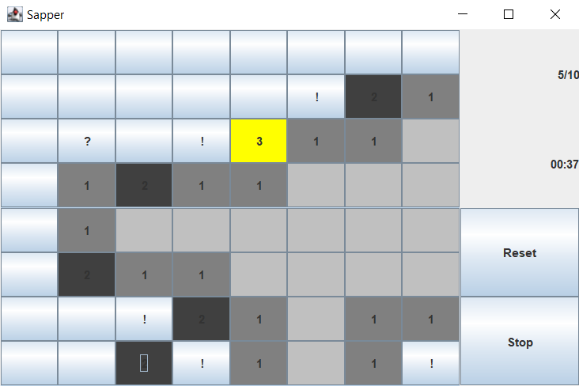
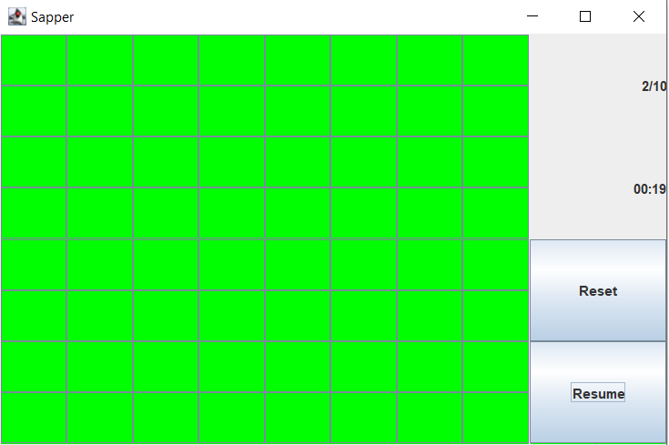

# Sapper

## General Information
Inspired by popular game - sapper.

There are empty fields and fields with mines in the game. 
Mines appear in random fields.
We can mark fields with mines mark, reveal fields or mark a question mark

## Screenshots
### Board with fields

### Game stopped

### Game won

## Technologies Used
- Java
- Swing
- Maven

## Features
- Board with fields
- Amount bombs
- Game time
- Reset button
- Stop button

### Functions of fields
- revealable fields - click right mouse
- fields showable number bombs of neighbour fields
- selectable bomb mark- click left mouse
- selectable question mark - twice click left mouse

## Usage
Run main method in Run class.

## Room for Improvement
- Configurable number of fields
- history of top times